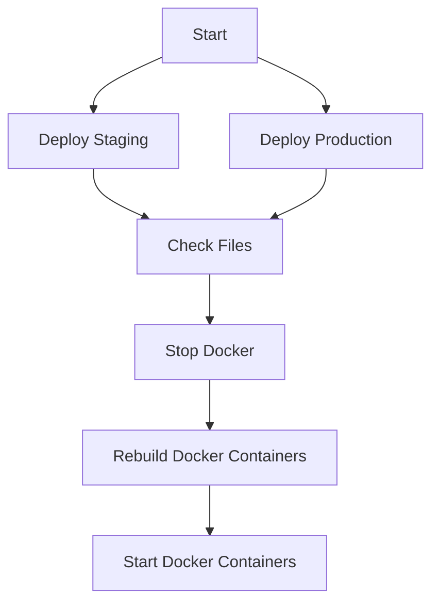

## What is this?

This is the source code for my website [https://schlenther.dev](https://schlenther.dev).  
The design of this portfolio is fully inspired by [@cnrad](https://github.com/cnrad/cnrad.dev).

## How to run this locally?

1. Clone this repository
2. Run `npm install`
3. Run `npm run dev`
4. Open your browser and navigate to `http://localhost:3000`
5. Enjoy!

### Run with Docker

1. Clone this repository
2. Run `docker compose up -d --build`
3. Open your browser and navigate to `http://schlenther.localhost`

## Deployment

This website is NOT deployed to vercel.  
This website is deployed to a KVM with Docker and Docker Compose.

## Original Repo

This repository is mirrored by https://git.lvckyworld.dev/iven.s/portfolio and its design is fully inspired by @cnrad