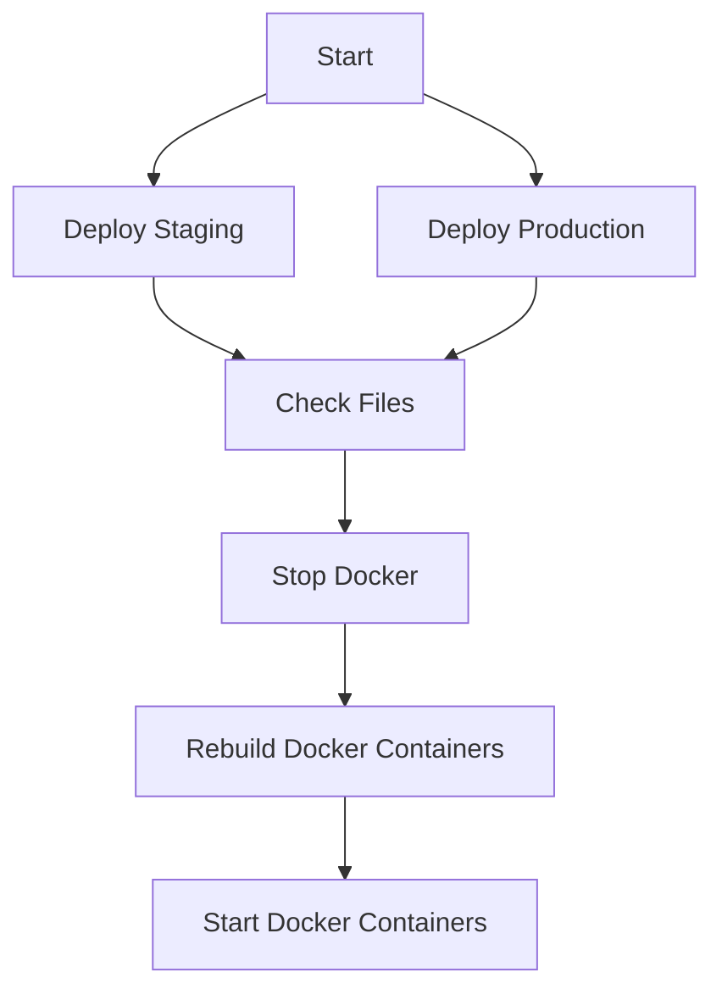

### Hey, I'm Iven 👋  

Iven Schlenther / Magdeburg, Germany  
I'm a Full Stack Developer

---

## What is this?

This is the source code for my website [https://schlenther.dev](https://schlenther.dev).  
The design of this portfolio is fully inspired by [@cnrad](https://github.com/cnrad/cnrad.dev).

## General information

Conrad's contact form uses Discord webhooks, while I use SMTP (email). The site notice comes
from [eRecht24](https://e-rech24.de).

While Conrad uses the classic page structure and inline css classes (tailwind), I mostly use SCSS with tailwind and the
app structure.
I have also added a cache for external API requests, as well as ratelimit and a honeypot.
My version does not pass on any client information like IP-Addresses to third parties and is therefore EU-DSGVO (GDPR)
and GER BDSG
compliant.

## Configuration

To configure the mailer, you need to edit the `.env` file in the root directory of the project.  
eRecht24 keys are stored there as well.

## How to run this locally?

1. Clone this repository
2. Run `npm install`
3. Run `npm run dev`
4. Open your browser and navigate to `http://localhost:3000`
5. Enjoy!

### Run with Docker

1. Clone this repository
2. Run `docker compose up -d --build`
3. Open your browser and navigate to `http://schlenther.localhost`

## Deployment

This website is NOT deployed to vercel.  
This website is deployed to a KVM with Docker and Docker Compose.

## Original Repo

This repository is mirrored by https://git.lvckyworld.dev/iven.s/portfolio and its design is fully inspired by @cnrad